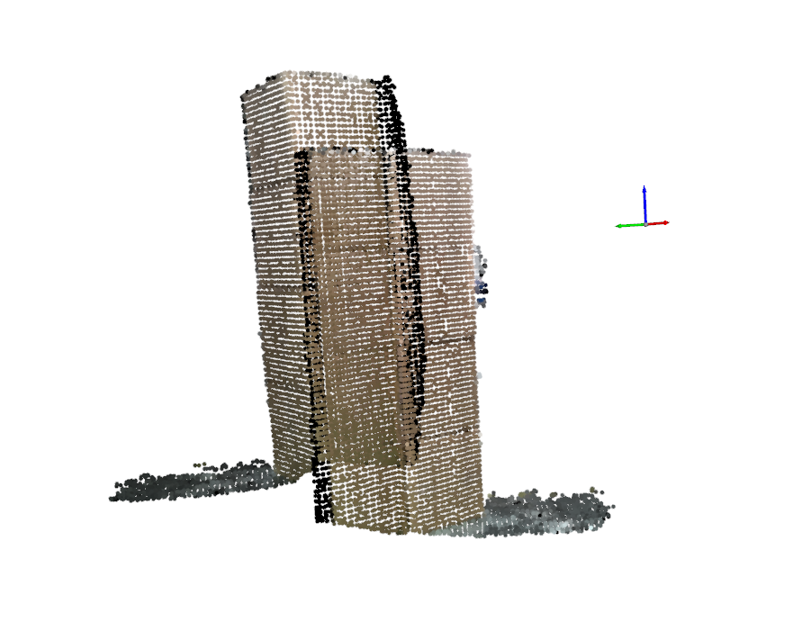
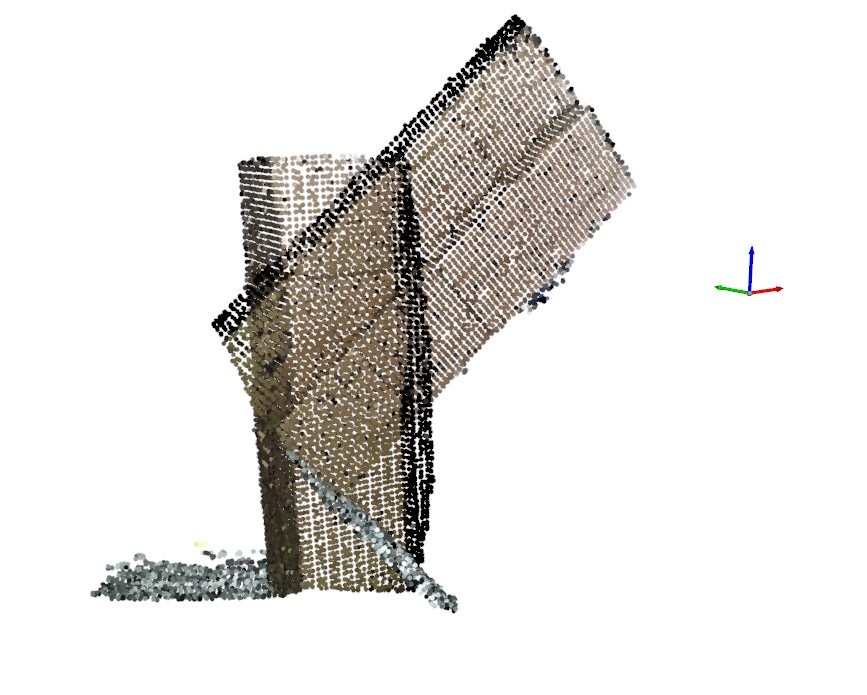
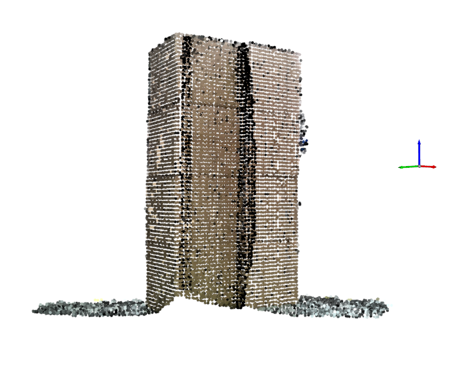
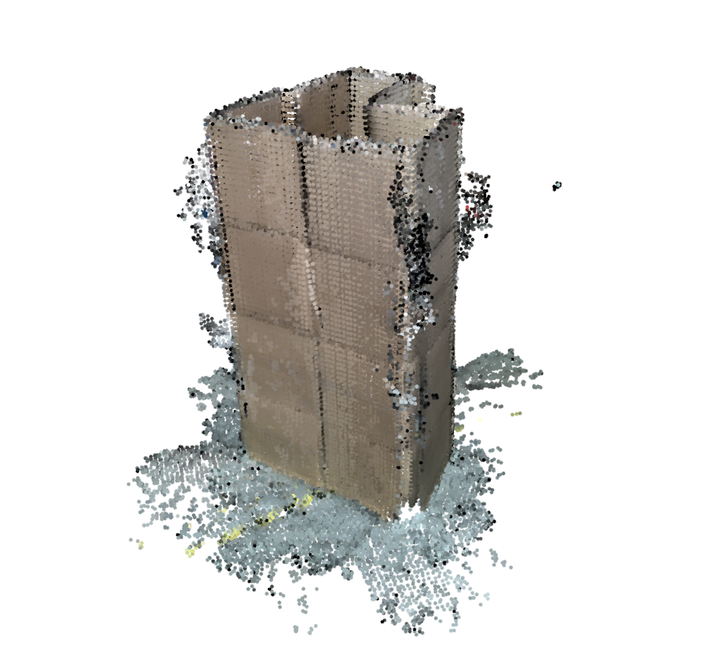
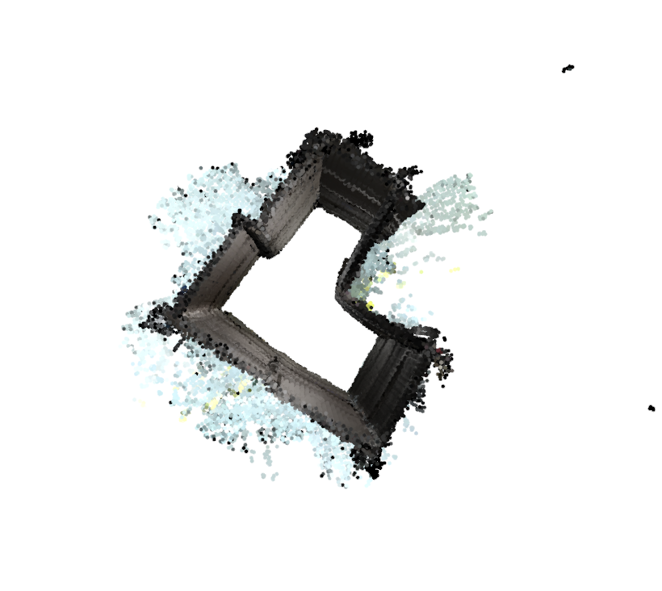

# Point Cloud Registration

Register and merge multiple noisy point clouds from kinectv2 via a constrained icp model.
C++ and Python version available.

## C++ Version
- Open3D (>= 0.5)
- Eigen 3
- Ceres solver
- PCL 1.8 (not used yet)

Use CMake to build.

## Python Version
`python3 py/main.py`

## Constrained ICP
Constrained ICP (CICP) is a modified point-to-plane ICP which fix the rotation axis and translation plane.

In the current implementation, the point cloud can only rotate around z-axis and translate on the x-y plane.

These constraints make ICP much more robust to the plane-dominated scenes like below.

Use original ICP:

Use constrained ICP:

The final merged point clouds:

## Suggestions
- It's still hard for ICP(even constrained ICP) to determine the best translation for the pure plane scene.
So make sure your scene consists of at least two independent planes when you scan.

- Merging after scanning is not the only way to build the model. 
Maybe we can try some RGBD-SLAM methods like KinectFusion and InfiniTAM to locate and build the scene model simultaneously.
